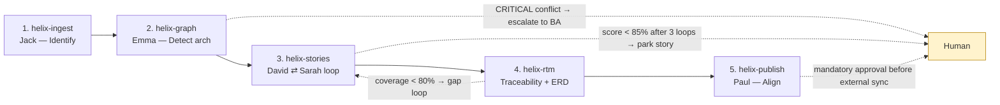

# Nexahelix Helix Pipeline — User Guide

The Nexahelix KG-BA pipeline turns raw requirements material (meeting transcripts, Basecamp threads, Jira tickets, briefs) into validated INVEST user stories, a five-layer Requirements Traceability Matrix with a domain ERD, and publish-ready Jira/Basecamp payloads — through five chained Claude Code skills with quality gates and human checkpoints.



---

## 1. Three things people get wrong (read first)

1. **The skills folder is not an input folder.** `~/.claude/skills/helix-*/` (and the repo copy `.claude/skills/helix-*/`) contain the skill *definitions* — instructions, not data. Never place source files there. You hand raw input to the pipeline in your message: pasted text, a file path, a Basecamp URL, or Jira keys.
2. **`ba_context.json` is an output, not something you initialize.** Stage 1 (Jack) *produces* it from your raw material. Your job is to review the extracted actors/entities afterwards, not to pre-fill them.
3. **All working artifacts go to `helix_runs/{project-slug}/`** under the directory where you run Claude Code — never into the skills folders.

---

## 2. Where everything lives

### Skill definitions (read-only during runs)

| Skill | Global path (active everywhere) | Repo copy (ships with BA-Toolkit) |
|---|---|---|
| Stage 1 | `~/.claude/skills/helix-ingest/SKILL.md` | `.claude/skills/helix-ingest/SKILL.md` |
| Stage 2 | `~/.claude/skills/helix-graph/SKILL.md` | `.claude/skills/helix-graph/SKILL.md` |
| Stage 3 | `~/.claude/skills/helix-stories/SKILL.md` | `.claude/skills/helix-stories/SKILL.md` |
| Stage 4 | `~/.claude/skills/helix-rtm/SKILL.md` (+ `references/coverage-thresholds.md`, `references/rtm-templates.md`) | `.claude/skills/helix-rtm/...` |
| Stage 5 | `~/.claude/skills/helix-publish/SKILL.md` | `.claude/skills/helix-publish/SKILL.md` |
| Orchestrator | `~/.claude/skills/helix-pipeline/SKILL.md` | `.claude/skills/helix-pipeline/SKILL.md` |

Edit these only to change pipeline *behavior*. Repo paths are relative to the repo root (`sol/`).

### Run artifacts (created per project)

Example: running from the `sol/` directory for a project called `checkout-refund`:

```
sol/helix_runs/checkout-refund/
├── helix_state.json               # state machine — resume reads this
├── ba_context.json                # Stage 1: actors, entities, flows, rules, ambiguities
├── ingestion_metadata.md          # Stage 1: human-readable twin of ba_context.json
├── impact_matrix.md               # Stage 2: conflicts, dependencies, cascade impact
├── knowledge_graph.json           # Stage 2: system graph — accretes across runs
├── strategy_analysis.md           # Stage 2: BN-nn business needs (RTM Layer 1)
├── user_stories.md                # Stage 3: INVEST stories + Gherkin ACs
├── validation_report.md           # Stage 3: scores, iteration history, parked stories
├── requirements_register.json     # Stage 3: the backlog register → feeds Stage 4
├── rtm_data.json                  # Stage 4: RTM data model
├── traceability_matrix.html       # Stage 4: interactive 5-layer RTM (open in browser)
├── domain_erd.md                  # Stage 4: Mermaid ERD + entity traceability table
├── rtm_summary.md                 # Stage 4: bilingual EN/VN summary
├── router_package.md              # Stage 5: transaction record + audit trail
├── wiki/US-001.md …               # Stage 5: Obsidian/Git-compatible wiki pages
└── payloads/US-001.json …         # Stage 5: Jira REST v3 / Basecamp payloads
```

---

## 3. Quick start

Run everything with one command from your project directory:

```
/helix-pipeline <paste transcript, give a file path, a Basecamp URL, or Jira keys>
```

The orchestrator runs stages 1→5, pauses at every gate, maintains `helix_state.json`, and ends with a bilingual run summary. The per-stage guide below tells you what to check at each pause, and how to drive stages individually.

---

## 4. Stage-by-stage guide

### Stage 1 — `/helix-ingest` (Jack · IDDA: Identify)

| | |
|---|---|
| **You provide** | Raw material in the message — pasted transcript, `docs/briefs/refund-feature.md`, a Basecamp message URL, or Jira ticket keys. No folder staging. |
| **It produces** | `ba_context.json`, `ingestion_metadata.md` |
| **Your checkpoint** | Review the **Actors** and **Entities** tables and the **AMB-nn** ambiguity list. Correct wrong actor names/permissions *now* — everything downstream inherits them. |
| **Gate** | A blocking ambiguity (sources contradict on the core flow) stops the run with questions for you. |

Jack extracts only what the text states — zero hallucination. Ambiguities become an elicitation backlog, not silent guesses.

### Stage 2 — `/helix-graph` (Emma · IDDA: Detect — architecture)

| | |
|---|---|
| **You provide** | Nothing if Stage 1 ran. *Optional but recommended:* last run's `knowledge_graph.json`, a schema dump, or ERD docs so the conflict scan checks against the real system. Without it, first-run mode marks every entity as new. |
| **It produces** | `impact_matrix.md`, `knowledge_graph.json`, `strategy_analysis.md` |
| **Your checkpoint** | Read `strategy_analysis.md` — confirm the **BN-nn business needs** match your project objectives (they become RTM Layer 1). Scan `impact_matrix.md` §2 for conflicts. |
| **Gate** | **CRITICAL CONFLICT** halts the pipeline and asks you for a design decision. It will not hand off to Stage 3 until resolved. |

### Stage 3 — `/helix-stories` (David ⇄ Sarah · IDDA: Deconstruct + Detect)

| | |
|---|---|
| **You provide** | Nothing — it reads Stage 1 + 2 outputs. Optionally, rework notes from a human review. |
| **It produces** | `user_stories.md`, `validation_report.md`, `requirements_register.json` |
| **The loop** | David drafts INVEST stories with Gherkin ACs; Sarah adversarially audits each one. **Confidence = completeness×0.4 + testability×0.3 + architectural-alignment×0.3. Pass at ≥ 85%. Max 3 rework iterations per story.** A story still failing after 3 loops is parked as `needs_human` — the pipeline continues with the rest. |
| **Your checkpoint** | Check `validation_report.md` for parked stories and blocking gaps. Then verify `requirements_register.json` is your populated backlog: every entry needs a `business_need_ref` (BN-nn), a MoSCoW priority, and Gherkin ACs. |

### Stage 4 — `/helix-rtm` (Traceability + ERD)

| | |
|---|---|
| **You provide** | Nothing in a pipeline run. Standalone: any requirements register or PRD set. |
| **It produces** | `rtm_data.json`, `traceability_matrix.html`, `domain_erd.md`, `rtm_summary.md` |
| **Your checkpoint** | Open `traceability_matrix.html` in a browser — filter by MoSCoW, coverage-gap type, source. Read `domain_erd.md`: every entity must trace to a requirement, `_TBD` attributes are open schema questions. |
| **Gate** | Coverage below **80%** (phase-specific thresholds: `~/.claude/skills/helix-rtm/references/coverage-thresholds.md` — 50% discovery → 100% compliance) emits `needs_gap_resolution`. The orchestrator loops back to Stage 3 for one gap-fill pass, or you explicitly accept the lower coverage. |

### Stage 5 — `/helix-publish` (Paul · IDDA: Align)

| | |
|---|---|
| **You provide** | The target platform: `Jira`, `Basecamp`, or `LocalMarkdownOnly`. |
| **It produces** | `router_package.md`, `wiki/US-nnn.md`, `payloads/US-nnn.json`; after sync, ticket keys/URLs written back into `requirements_register.json` `source_refs`. |
| **Hard gates** | (1) Only PASSED stories are packaged — parked ones are listed as *withheld*. (2) **Nothing is sent to an external system until you explicitly approve the publish manifest.** (3) No raw customer PII in payloads. |
| **Rule** | Paul never rewrites story content — packaging and routing only. |

---

## 5. Orchestrator operations

### Resume an interrupted run

```
/helix-pipeline resume checkout-refund
```

Reads `helix_runs/checkout-refund/helix_state.json`, reports per-stage status, and continues from the first non-complete stage. Completed stages are never re-run unless you ask (e.g., inputs changed).

### Enter mid-chain

You don't have to start at Stage 1. The chain is joinable wherever the required inputs exist — e.g., run `/helix-rtm` directly on an existing requirements register, or `/helix-stories` on a hand-built `ba_context.json` + `impact_matrix.md`.

### Fix problems at the root, not the output

Paul refuses content edits by design. If Stage 5 output looks wrong, trace upstream and resume:

| Symptom | Root cause file | Fix |
|---|---|---|
| Wrong actor names, missing entities, wrong flows | `ba_context.json` | Re-run `/helix-ingest` with corrections, then resume |
| Stories solve the wrong problem | `strategy_analysis.md` (BN-nn framing) | Re-run `/helix-graph`, then resume |
| Weak/vague acceptance criteria | Stage 3 loop | Use the HIL "Request rework" option — human feedback grants a 4th iteration |
| Low RTM coverage | Orphaned requirements / missing ACs | Let the gap-resolution loop run, or link source items and re-run `/helix-rtm` |

### The graph accretes — reuse it

`knowledge_graph.json` from this run is the "existing system" input for your **next** feature's Stage 2. Feed it in each time; Emma's conflict and duplication detection gets sharper with every project.

### Autonomous mode (cron / loops)

Optional checkpoints (post-ingest review) are skipped; the Stage 5 publish approval is **never** skipped — an unattended run ends at `stories`/`rtm` in a `needs_human` state rather than publishing on its own.

---

## 6. The signal contract (for chaining and automation)

Every stage ends with a fenced JSON signal so the orchestrator — or any agentic loop — can advance mechanically:

```json
{
  "pipeline": "nexahelix",
  "phase": "<stage>_complete",
  "project": "{project-slug}",
  "artefacts": ["..."],
  "status": "ok | needs_human | escalate",
  "next": "/helix-<next-stage>"
}
```

`status: ok` → advance to `next` · `escalate` → BA design decision required · `needs_human` → HIL options presented. Stage 5 emits `"next": null` and `"loop": "complete"`.

---

## 7. Related skills

- `/babok-v3` — BABOK knowledge base; consulted *inside* stages for technique guidance. Not a pipeline stage.
- `/ba-glossary` — term definitions.
- `/prd-traceability-matrix` — generic HTML-only RTM; **not** part of this chain. Use `/helix-rtm` for pipeline work.

Source designs: `sample_agenticBAs/` (agent system prompts for Jack/Emma/David/Sarah/Paul, the IDDA reasoning framework, and orchestration rules) in the parent project folder.
